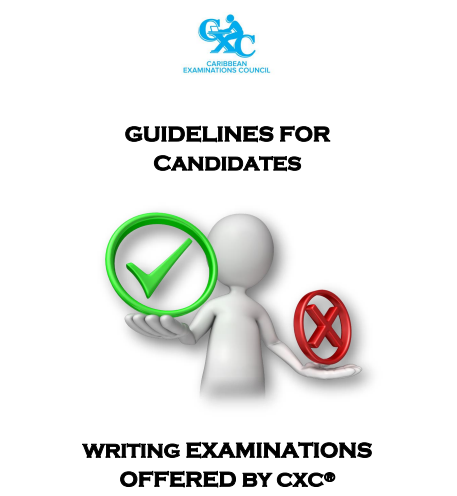

# awesome CSEC 

**A curated list of awesome CSEC resources for Caribbean students.** Please make a pull request or **_[send an e-mail](mailto:jamarnplummer@gmail.com?subject=Request)_** if you would like to add content!

---------------

## Table of Contents
- [Official Resources](#official-resources)
    - [Official Schedule](#official-schedule)
    - [Topics](#topics)
    - [Guidelines](#guidelines)
- [Websites](#websites)
    - [Past Papers](#past-papers)
    - [Study guides](#study-guides)
- [Social Media Accounts](#social-media)
    - [Twitter Accounts](#twitter-accounts)
    - [Facebook Groups](#facebook-groups)
    - ~~[Instagram Pages](#instagram-pages)~~
- [Youtube Channels](#youtube-channels)
- [Learning Apps](#learning-apps)
- [Print Material and Textbooks](#print-material-and-textbooks)
- [Interactive Learning](#interactive-learning)
- ~~[Educational Tools and Software](#educational-tools-and-software)~~
- [Tutoring](#tutoring)

-------------

## Official Resources

### Official Schedule
- [CXC Official Time Table](https://www.cxc.org/examinations/csec/timetables/) - Links to the official time table of the current year.

### Topics
- [CXC Official Syllabus](https://www.cxc.org/syllabus-downloads/#1687885738874-b1da68f7-bd27) - The official syllabus for each subject. Scroll down, select your subject and make notes!

### Guidelines
- [SBA Do's and Don'ts](https://www.cxc.org/SiteAssets/MANUALS/CSEC%20sba%20dos%20and%20donts%20(2)%20(2).pdf) - Make sure your SBA is in order.

- [Guidelines to Candidates](https://www.cxc.org/wp-content/uploads/2018/11/Guidelines-to-Candidates-10March2022.pdf) - A ton of information regarding rules and regulations, as well as the **CXC E-mails**.

---------

## Websites

### Past Papers
- [cxcpastpapers.com](https://www.csecpastpapers.com/) - This website is not affiliated with the official CXC body. They do, however, carry a lot of past papers for each subject area!

- [pastpapersforall](https://sites.google.com/view/pastpapersforall/) - A lame looking Google Site, but it contains a lot of valuable links for students, including markschemes!

- [cxcprep](https://cxcprep.netlify.app/) - A less ugly-looking a site than pastpapersforall. This is a searchable database of Past Papersfor CXC and CAPE.

### Study Guides

- [www.csecmathtutor.com](https://www.csecmathtutor.com/) - A legendary website. It has been around for years, and has saved the lives of many students!

- [faspassmaths.com](https://faspassmaths.com/secondary-school/#csec-maths-solutions) - Another legendary site. Has a ton of solutions for Math Papers.

- [Miscellaneous](https://global.oup.com/education/content/secondary/series/cxc-study-guides/?view=ProductList&region=uk) - A listing of all the official CXC study guides. No need to purchase. You can find online PDFs of them elsewhere.
----------
## Social Media Accounts

### Twitter Accounts
- [@MyCXC](https://twitter.com/MyCXC?ref_src=twsrc%5Egoogle%7Ctwcamp%5Eserp%7Ctwgr%5Eauthor) - The official CXC Account on Twitter (or X, if you prefer).

- More pending. **_[E-mail me some!](mailto:jamarnplummer@gmail.com?subject=Request)_**
### Facebook Groups
Being very honest, nobody under 35 uses Facebook. On the bright side, this means a lot of professional teachers and tutors are active!

- [CSEC Help](https://www.facebook.com/groups/1870398126378104/) - A lot of ads, but you'll find a fair bit of tutors making posts.

- [CSEC Maths Study Group](https://www.facebook.com/groups/156995437671285/) - Same story as above, however it is much more active and very little bot posts.

---------

## YouTube Channels
- [@CSECMathematics](https://www.youtube.com/c/CSECMathematics) - A channel run by Terry David, an Electrical and Computer Engineer.

- [@csecmathtutor3065](https://www.youtube.com/channel/UCGDuzDIVXmKGdOtkBzJaqiA) - The Official CSEC Math Tutor page. Unfortunately, they didn't set their @ in time :(

- [@TheSchoolOfJ](https://www.youtube.com/channel/UCp7Dcs912hXQQIVmBctSL6Q) - Channel run by Jamar Plummer (jam). Videos on Mathematics, Biology, Chemistry, and Physics are posted frequently!

- [@TheOrganicChemistryTutor](https://www.youtube.com/@TheOrganicChemistryTutor) - The GOAT of Mathematics videos on YouTube.

- [@Cognitoedu](https://www.youtube.com/@Cognitoedu) - Amazing, short animated videos for Biology, Physics, and Chemistry!

- [@TelevisionJamaica](https://www.youtube.com/@TelevisionJamaica) - During Covid, TVJ ran a series for CSEC students teaching various topics from each subject area. Unfortunately, they have yet to make a playlist compiling them.

----------

## Learning Apps

- [Duolingo](https://duolingo.com) - An amazing language learning tool for all the Romance languages as well as many others!

----------

## Print Material and Textbooks
For print material and textbooks, you should aim to find free pdfs and copies of books.

- [PDF Coffee](https://pdfcoffee.com) Many free PDFs.

- [academia.edu](https://academia.edu) Contains a lot copies of Carlong books, as well as each science concise. If you do sign up, be sure to disable e-mails ASAP.

----------

## Interactive Learning
- [Khan Academy](https://khanacademy.org) Hands-down the best learning platform for Mathematics and all Sciences. Completely free.

----------

## ~~Educational Tools and Software~~

----------

## Tutoring
Please refer to **[Facebook Groups](facebook-groups)** for more resources.

----------

